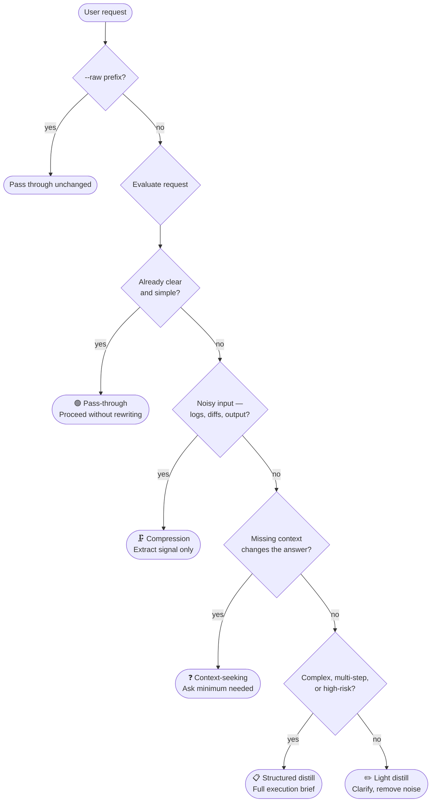

# Distill

   

**Turns vague, messy, or under-specified AI requests into clear, efficient instructions — while preserving your intent.**

Use it on-demand, or run it always-on. Either way, if your request is already clear, Distill does nothing.

```
/distill fix this bug
/distill migrate this project from Firebase to Postgres
/distill help me figure out why this test keeps flaking
```

---

## ⚡ How it works

Before solving, Distill evaluates the request and picks one of five modes automatically:



### Task profiles

Distill applies a different lens depending on what you're doing:

| Profile | Distills toward |
|---|---|
| 🐛 **Debugging** | Observed vs expected, root cause, minimal fix, verification step |
| 🔨 **Code implementation** | Feature goal, affected areas, edge cases, acceptance criteria |
| ♻️ **Refactor** | Behavior preservation, boundaries, risk areas, diff focus |
| 🏗️ **Architecture / design** | Trade-offs, constraints, recommended path, migration plan |
| ✍️ **Writing / communication** | Audience, tone, key message, constraints, desired length |
| 📚 **Learning / explanation** | Knowledge level, depth, examples only where useful |
| 🔍 **Research / comparison** | Criteria, options, freshness, sourced recommendation |

### Restraint rules

- No fake expertise, fake citations, or invented context
- No clarifying questions unless missing information actually changes the result
- No framework added unless the task needs it
- No rewriting the user's actual deliverable unless asked
- Pass-through when the request is already good

---

## 🚀 Install

### One line — auto-detects your agents

```bash
curl -fsSL https://raw.githubusercontent.com/eternalsayed/distill-prompts/main/install.sh | bash
```

Detects which agents are installed and installs for all of them in one pass. Idempotent — safe to run again.

### Install for a specific agent

```bash
curl -fsSL https://raw.githubusercontent.com/eternalsayed/distill-prompts/main/install.sh | bash -s -- --claude
curl -fsSL https://raw.githubusercontent.com/eternalsayed/distill-prompts/main/install.sh | bash -s -- --codex
curl -fsSL https://raw.githubusercontent.com/eternalsayed/distill-prompts/main/install.sh | bash -s -- --cline
curl -fsSL https://raw.githubusercontent.com/eternalsayed/distill-prompts/main/install.sh | bash -s -- --kilo
curl -fsSL https://raw.githubusercontent.com/eternalsayed/distill-prompts/main/install.sh | bash -s -- --amp
curl -fsSL https://raw.githubusercontent.com/eternalsayed/distill-prompts/main/install.sh | bash -s -- --opencode
curl -fsSL https://raw.githubusercontent.com/eternalsayed/distill-prompts/main/install.sh | bash -s -- --gemini
curl -fsSL https://raw.githubusercontent.com/eternalsayed/distill-prompts/main/install.sh | bash -s -- --antigravity
curl -fsSL https://raw.githubusercontent.com/eternalsayed/distill-prompts/main/install.sh | bash -s -- --continue
curl -fsSL https://raw.githubusercontent.com/eternalsayed/distill-prompts/main/install.sh | bash -s -- --windsurf
curl -fsSL https://raw.githubusercontent.com/eternalsayed/distill-prompts/main/install.sh | bash -s -- --aider

# Install for all agents regardless of detection
curl -fsSL https://raw.githubusercontent.com/eternalsayed/distill-prompts/main/install.sh | bash -s -- --all
```

### What gets installed where

| Agent | Install location | Trigger |
|---|---|---|
| Claude Code | `~/.claude/skills/distill/SKILL.md` + CLAUDE.md entry | `/distill` |
| Codex CLI | appended to `~/.codex/AGENTS.md` | `distill this:` |
| Cline | `~/.cline/skills/distill/SKILL.md` | `/distill` |
| KiloCode | `~/.kilo/skills/distill/SKILL.md` | `/distill` |
| Amp | `~/.amp/skills/distill/SKILL.md` | `/distill` |
| OpenCode | `~/.config/opencode/skills/distill/SKILL.md` | `/distill` |
| Gemini CLI | `~/.gemini/skills/distill/SKILL.md` | `distill this:` |
| Antigravity | `~/.gemini/config/skills/distill/SKILL.md` | `/distill` |
| Continue.dev | `~/.continue/rules/distill.md` | active automatically |
| Windsurf | appended to `~/.windsurf/rules/global_rules.md` | `distill this:` |
| Aider | `~/.aider.distill.md` + `~/.aider.conf.yml` entry | loaded every session |
| **Cursor** | **manual** — paste into Settings → Rules for AI | `distill this:` |

### Always-on mode

After installing, add this block to `~/.claude/CLAUDE.md` (Claude Code) or your agent's equivalent global config:

```markdown
# distill (always-on)
Before answering any request, silently apply Distill using the installed Distill skill.
Choose the appropriate mode (pass-through, light, structured, context-seeking, or compression) based on the request.
Skip distill and proceed directly if the user prefixes their message with `--raw`.
```

To turn off always-on: remove that block. The `/distill` trigger stays available.

To skip a single request in always-on mode: prefix with `--raw`.

```
--raw just tell me what this function returns
```

### Cursor (manual)

Cursor's global rules are managed in the IDE, not a file. To add Distill:

1. Open Cursor → Settings → Rules for AI
2. Paste the body of `distill.skill.md` (everything below the `---` frontmatter block)

Trigger with `distill this:` in any prompt.

### Manual install for any other system

<details>
<summary>Expand</summary>

Paste the body of `distill.skill.md` (below the `---` frontmatter) into your system prompt, custom instructions, or agent config file. Prefix requests with `distill this:` to invoke it explicitly.

For agents that support `SKILL.md` format directly, copy the full file (including frontmatter) to the agent's global skills directory.

</details>

---

## 🆚 Why this is different

Most prompt optimizer tools always do something — they rewrite every prompt, even clear ones. Distill has a genuine **pass-through mode**: when the request is already good, it proceeds without touching it.

Combined with **task-type profiles** (debugging vs refactoring vs architecture vs writing each get different treatment), this means always-on Distill doesn't add noise to requests that don't need it.

| | Distill | prompt-improver | prompt-optimizer | Ponytail |
|---|---|---|---|---|
| Always-on mode | ✅ Optional | ✅ Default only | ✅ Default only | ✅ Default only |
| Explicit `/distill` mode | ✅ | ❌ | ✅ `/optimize` | ❌ |
| Pass-through (no-op on clear requests) | ✅ Core feature | ❌ | ❌ | ❌ |
| Task-type profiles | ✅ 7 profiles | ❌ | ❌ | Code only |
| Compression mode for logs/output | ✅ | ❌ | ❌ | ❌ |
| Per-request off switch (`--raw`) | ✅ | ❌ | ❌ | ❌ |
| Dependencies | None | Hook + marketplace | Go binary + UI | Hook + marketplace |
| Portability | Any LLM system | Claude Code only | Claude Code only | Claude Code + others |

[Ponytail](https://github.com/DietrichGebert/ponytail) and Distill are complementary — Ponytail makes the AI write less code; Distill makes your request clearer before it writes anything.

---

## 📊 Benchmark

Local prompt-readiness benchmark, 2026-06-25.

Method: 10 realistic requests from `distill-test-plan.md` were scored twice: once as the raw user request, once after applying Distill. Each case used the same 8-metric scorecard: intent preservation, focus, correctness, context use, efficiency, verification, safety, and output usefulness. Maximum score is 40 per case.

| Test case | Raw | Distill | Lift |
|---|---:|---:|---:|
| Simple pass-through | 37 | 38 | +3% |
| Vague debugging request | 18 | 35 | +94% |
| Noisy terminal logs | 20 | 36 | +80% |
| Vague feature request | 19 | 34 | +79% |
| Refactor safety request | 21 | 35 | +67% |
| Architecture decision | 22 | 36 | +64% |
| Writing task | 24 | 34 | +42% |
| High-impact financial question | 18 | 37 | +106% |
| Already-clear coding request | 38 | 38 | 0% |
| Vague failing-tests request | 20 | 35 | +75% |

**Overall: 59% → 90% average quality (+51% lift)**

Where Distill helped most:

- **Ambiguous coding work** — turned "fix this bug" and "fix failing tests" into inspect-first, minimal-fix, verify-after workflows
- **High-risk advice** — avoided overconfident answers and added constraint/safety handling
- **Noisy inputs** — extracted the actionable signal instead of reacting to the whole paste
- **Clear prompts** — passed through without meaningful expansion

Limit: this benchmark measures prompt/request quality before execution, not independent downstream model success. Use `distill-test-plan.md` to reproduce the benchmark across multiple agents and real coding tasks.

### Live example: debugging the installer

**Raw request:** `"the installer doesn't always work"`

> **Without distill** — scanned the full script defensively: added `set -eu`, wrapped detection lines in `|| true` guards, touched `mktemp` and CLAUDE.md write path speculatively, added a vague retry comment. Result: 8 locations changed, 2 addressing real bugs, **6 unnecessary**.

> **With distill** — Debugging profile identified this as missing-context: inspect auto-detect for false positives, inspect curl for silent failures, inspect `skill_body()` for cross-platform issues. Result: 3 targeted fixes, each confirmed:

| Bug | Root cause | Fix |
|---|---|---|
| Antigravity false positive | `[ -d ~/.gemini/config ]` matches all Gemini CLI users | Changed to `[ -d ~/.gemini/antigravity ]` only |
| Silent curl failure | `set -e` exits without a message on network error | Wrapped curl in `if !` with a user-facing error |
| CRLF frontmatter strip | `awk` `/^---$/` misses Windows line endings | Added `\r?` and `gsub(/\r$/,"")` |

**18 lines changed vs 31 · 3 real bugs fixed vs 2 · 0 unnecessary changes vs 6**

---

## 💡 Examples

**Compress noisy logs**
```
/distill help me debug this
<paste 200 lines of terminal output>
```
Extracts the primary error, relevant file/version details, and likely cause — then solves from there.

**Architecture decision**
```
/distill migrate Firestore to Postgres
```
Identifies missing constraints, proposes a phased plan, flags what should stay vs move.

**Inspect what Distill produced**
```
/distill explain docker to me
> what did you distill this into?
```

---

## 📁 Files

| File | Purpose |
|---|---|
| `distill.skill.md` | The skill — installed as `~/.claude/skills/distill/SKILL.md` |
| `install.sh` | One-line installer for 11 agents |
| `distill-test-plan.md` | Before/after methodology to measure Distill's impact |

---

## Contributing

If Distill makes a request worse, open an issue with the original request, what Distill produced, and what you expected. That's the most useful signal for improving the task profiles and restraint rules.

---

## License

MIT
